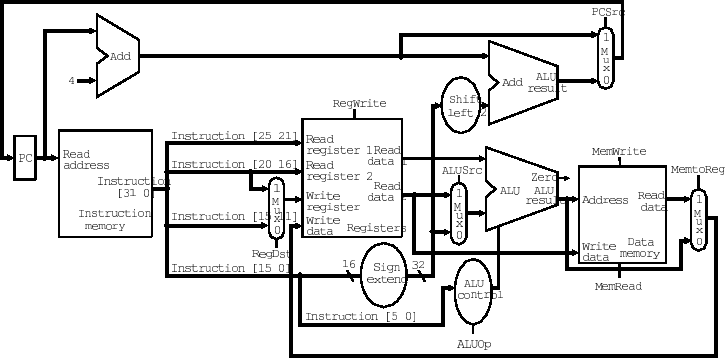

# RISC-V Single Cycle Processor

A Verilog implementation of a 32-bit single-cycle RISC-V processor supporting a subset of the RV32I instruction set.

---

## 📖 Project Overview

This Verilog-based CPU project implements a complete single-cycle RISC-V processor with:

- Full instruction fetch, decode, execute, memory, and writeback stages
- Support for basic arithmetic, logical, and memory operations
- Register file with 32 registers
- Sign extension unit for immediate values
- Modular design with clean separation of components

---

## 🚀 Features

- Complete single-cycle implementation of RISC-V ISA subset
- Supports:
  - Arithmetic operations (ADD, SUB)
  - Logical operations (AND, OR, XOR)
  - Memory operations (LW, SW)
  - Control flow (BEQ)
- Modular Verilog implementation
- Data memory and instruction memory modules
- Hazard-free design (single cycle)

---

## 🔧 Technologies Used

- **Hardware Description Language:** Verilog (IEEE 1364-2001)
- **Simulation Tools:** ModelSim, Vivado, or any Verilog simulator
- **Processor Architecture:** 32-bit RISC-V (RV32I subset)
- **Memory:** Separate instruction and data memory

---

## 🧠 Processor Architecture

| Component               | Module               | Description                          |
|-------------------------|----------------------|--------------------------------------|
| Instruction Fetch       | `FetchStage`         | Fetches instructions from memory     |
| Decode                  | `decode_cycle`       | Decodes instructions and reads registers |
| Execute                 | `execute_cycle`      | Performs ALU operations              |
| Memory Access           | `memory_cycle`       | Handles memory reads/writes          |
| Write Back              | `writeback_cycle`    | Writes results back to registers     |
| Control Unit            | `Control_Unit_top`   | Generates control signals            |
| ALU                     | `ALU`                | Arithmetic Logic Unit                |
| Register File           | `Register_File`      | 32-register file                     |

---

## 📄 Documentation

The processor implements the following instruction formats:

- R-type: Register operations
- I-type: Immediate operations and loads
- S-type: Store operations
- B-type: Branch operations

---

## 💻 Source Code Structure

| Folder               | Description                     |
|-------------------------|----------------------|
| /alu       | ALU implementation                        |
| /control   | Control unit components                   |
| /memory    | Memory components                         |
| /pipeline  | Pipeline stage components                 |
| /utils     | Utility modules (muxes, adders, etc.)     |
| /tb        | Testbench files                           |
| /docs      | Documentation and diagrams                |

---

## 🛠️ Installation
1. Clone the repository:
   ```bash
   git clone https://github.com/yourusername/riscv-single-cycle-processor.git
   cd riscv-single-cycle-processor
   ```
2. Compile the Verilog code:
   ```bash
   make compile
   ```
   
3. Run the simulation:
   ```bash
   make simulate
   ```

4. View waveforms:
   ```bash
   make view-waveforms
   ```

### Synthesis
The design is ready for synthesis with standard ASIC or FPGA tools.

---

## 📸 Block Diagram



---

## 👥 Author

- [Aleeza Rizwan](https://github.com/its-aleezA)
- [Ayesha Akhtar](https://github.com/AyeshaAkhtar08)

---

## 🔖 License

This project is licensed under the MIT License.  
See the [LICENSE](LICENSE) file for full details.
